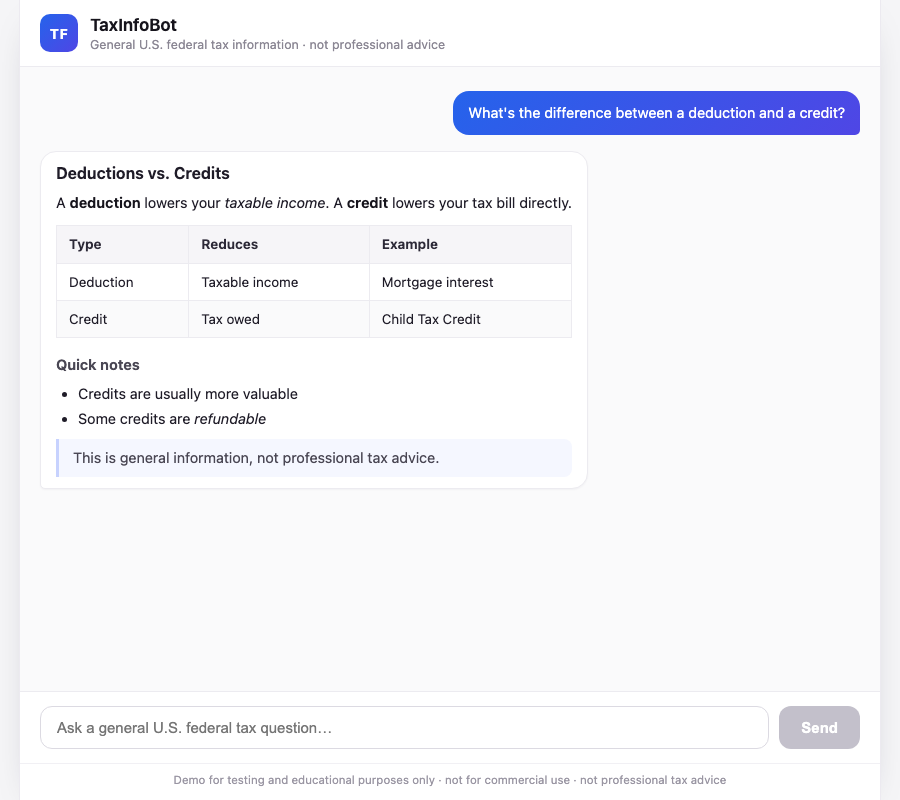
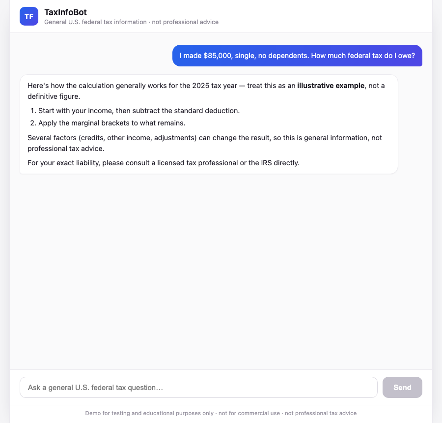

# Streaming Chatbot (Spring AI + React)

A production-style, **domain-agnostic** chatbot template: a Spring Boot + Spring AI
backend over the Anthropic Claude API, paired with a React + Vite frontend. It gives
you token-by-token streaming, per-conversation memory, a configurable guardrailed
system prompt, and an LLM-as-judge evaluation harness out of the box.

The behavior is driven entirely by configuration — **retarget it to any domain by
swapping two things**:

- the **system prompt** ([`tax-system-prompt.st`](chatbot-api/src/main/resources/prompts/tax-system-prompt.st))
- the **evaluation dataset** ([`dataset.json`](chatbot-api/src/test/resources/evals/dataset.json))

No code changes required.

## Demo: TaxInfoBot

This repo ships configured as **TaxInfoBot**, an assistant for general U.S. federal tax
questions — guardrailed to stay on topic, decline individualized advice, and refuse
unlawful requests. It serves as a worked example of the template, not a product.

## Architecture

```
chatbot-claude/
├── chatbot-api/   Spring Boot backend — Claude API, prompt, memory, eval harness
└── chatbot-ui/    React + Vite frontend — streaming chat, Markdown rendering
```

The browser talks to the backend through a single streaming endpoint (`POST /api`,
Server-Sent Events). The server owns the conversation id and returns it via the
`X-Conversation-Id` header so the UI can continue the same memory thread.

| Component | Stack | Details |
| --- | --- | --- |
| **Backend** | Java 21, Spring Boot 4.1, Spring AI 2.0 | [chatbot-api/README.md](chatbot-api/README.md) |
| **Frontend** | React 19, TypeScript, Vite 8 | [chatbot-ui/README.md](chatbot-ui/README.md) |

## Screenshots

| Welcome | Formatted answer | Guardrail |
| --- | --- | --- |
|  |  |  |

## Quick start

Run the backend and frontend in two terminals.

```bash
# 1. Backend (http://localhost:8080)
cd chatbot-api
export ANTHROPIC_API_KEY=sk-ant-...
./gradlew bootRun

# 2. Frontend (http://localhost:5173)
cd chatbot-ui
npm install
npm run dev
```

The Vite dev server proxies `/api` to the backend, so open
[http://localhost:5173](http://localhost:5173) and start chatting.

See each component's README for configuration, tests, and the prompt evaluation suite.

## Disclaimer

This project is a **demo for testing and educational purposes only**. It is **not for
commercial use** and, in its TaxInfoBot configuration, does **not** provide professional
tax advice.
